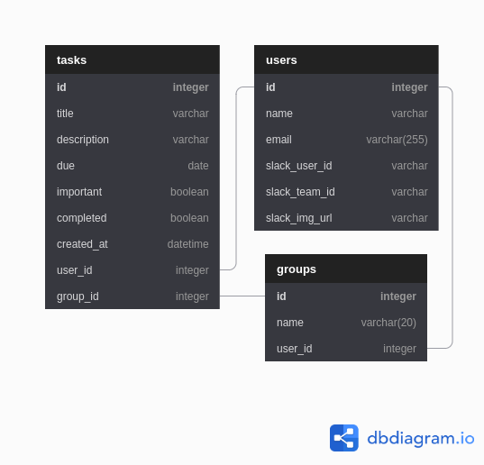

# Dev docs

Here are docs for those would like to contribute to Dolt or want explanations to what is happening behind the scenes.

## Database schema

Below is the database schema that the Dolt backend is based on. I used [Dbdiagram](dbdiagram.io) to create the schema.



## Standard user flow of Dolt

Here is a step by step overview of the user flow for the app:

1. Arrive at the homepage and sign in with Slack
2. Login successful, reach the task manager dashboard
3. Create tasks with different attributes
4. Add these tasks to a group (user could have also created the groups first)
5. After getting familiar with the web app, user installs the Dolt app to their Slack workspace
6. User learns the slash commands
7. User can now view and add both tasks and groups with the right commands

## Slack API

The [Slack API](https://api.slack.com/) provides functionality through its Oauth and slash commands. More features can be built later as well, for example the ability to tag other Slack users and assign tasks to them.

## Technology stack

- Flask-Python
- Postgresql
- SQL Alchemy
- Unit testing
- Axios.js
- jQuery
- Bootstrap
- Popper.js
- Jinja

## Set up development environment

Feel free to fork the repository if you would like to contribute or modify it to your own liking :)

Once you have forked, follow these steps:

1. Set up a virtual environment in the root folder

   ```bash
   # Creates venv folder
   python3 -m venv venv

   # Activates venv
   source venv/bin/activate
   ```

2. You should be in your virtual environment and are ready to install the required packages. View `requirements.txt` if you are curious on what needs to be installed.

   ```bash
   pip install -r requirements.txt
   ```

3. You could do this at any point, but it is important to add a `.gitignore` file so that you don't commit your gigantic `venv` folder. Do this instead:

   ```bash
   # Create .gitignore if file does not exist
   touch .gitignore

   # Add files to .gitignore
   # Use ">>" to add multiple files
   echo 'venv' >> .gitignore
   echo '.gitignore' >> .gitignore
   ```

### Environmental variables

Below are a list of environmental variables that are needed for the app to work.

1. Create a `.env` file in the root folder

   ```bash
   # Creates the .env file
   touch .env

   # Add .env to .gitignore
   echo '.env' >> .gitignore
   ```

2. Go to the [Slack API](api.slack.com) and create your Dolt app. The Slack docs are pretty easy to follow so that you can get the functionality that you would like. Then you can add your variables to the `.env` file in the root folder

   ```bash
   # Your .env file should look like below. Be sure to add in your own credentials. They should be safe from being commited to Github since you added .env to your .gitignore.
   SLACK_CLIENT_ID=YOUR_SLACK_CLIENT_ID
   SLACK_CLIENT_SECRET=YOUR_SLACK_CLIENT_SECRET
   SLACK_SIGNING_SECRET=YOUR_SLACK_SIGNING_SECRET
   ```
